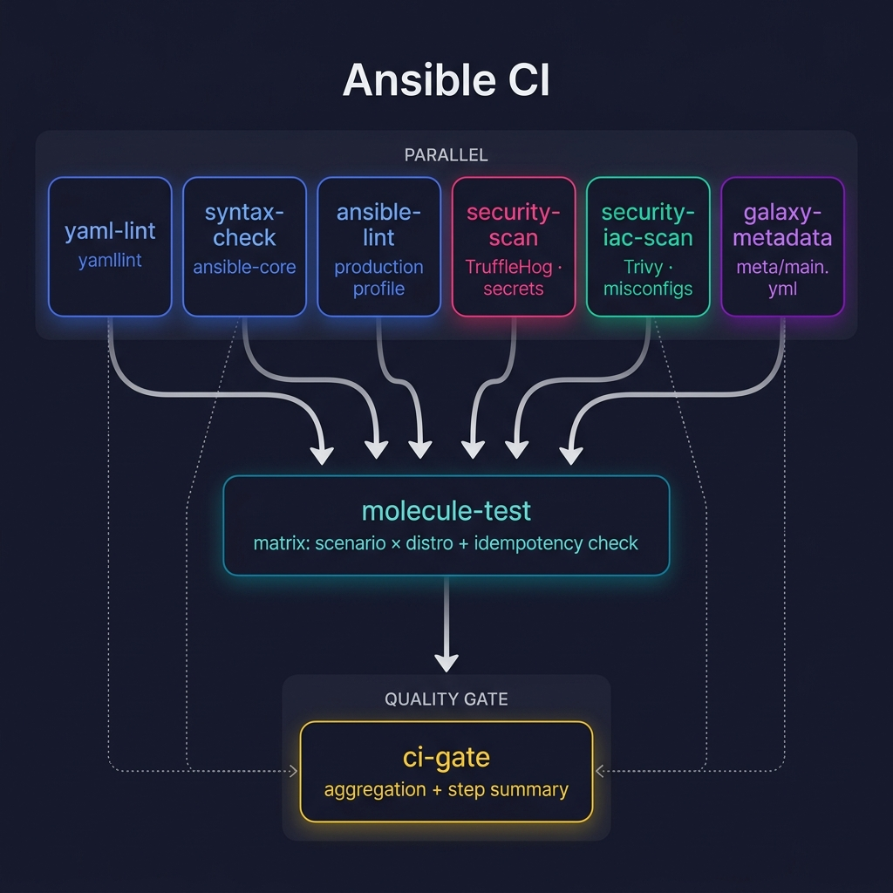

# github-actions-workflows

[](https://github.com/grzegorzfranus/github-actions-workflows/actions/workflows/ci.yml)
[](https://github.com/grzegorzfranus/github-actions-workflows/actions/workflows/release.yml)
[](LICENSE)

Centralized, reusable GitHub Actions workflows for consistent CI/CD across all
repositories.

## Author

| Field      | Value                                                           |
| ---------- | --------------------------------------------------------------- |
| Author     | Grzegorz Franus                                                 |
| Company    | EWARE                                                           |
| License    | [Apache-2.0](LICENSE)                                           |
| Repository | [github-actions-workflows](https://github.com/grzegorzfranus/github-actions-workflows) |

## Available Workflows

| Workflow | File | Description | Status |
| -------- | ---- | ----------- | ------ |
| Ansible CI | [`ansible-ci.yml`](.github/workflows/ansible-ci.yml) | Lint (YAML + Syntax + Ansible) + Security (TruffleHog + Trivy) + Galaxy metadata + Molecule (with idempotency) | Active |
| Ansible Publish | [`ansible-publish-galaxy.yml`](.github/workflows/ansible-publish-galaxy.yml) | Pre-publish validation + Galaxy import with retry | Active |

## Pipeline Architecture



The pipeline runs 6 checks in parallel, gates Molecule tests behind all of them,
and aggregates results in a final CI Gate with GitHub Step Summary.

## Quick Start

### Ansible Role — CI

In your Ansible role repository, create `.github/workflows/ci.yml`:

```yaml
---
name: "CI/CD"

on:
  push:
    branches: [main]
  pull_request:

jobs:
  ci:
    uses: grzegorzfranus/github-actions-workflows/.github/workflows/ansible-ci.yml@v1
    with:
      molecule-scenarios: '["default"]'
      molecule-distros: '["ubuntu2404", "debian12", "rockylinux9"]'
```

> **Tip:** For reproducible builds, copy `requirements-ansible-ci.txt` to your role
> repository and pass it via the `requirements-ci-file` input.

### Ansible Role — Publish to Galaxy

Create `.github/workflows/publish.yml`:

```yaml
---
name: "Publish"

on:
  release:
    types: [created]

jobs:
  publish:
    uses: grzegorzfranus/github-actions-workflows/.github/workflows/ansible-publish-galaxy.yml@v1
    secrets:
      galaxy-api-key: ${{ secrets.GALAXY_API_KEY }}
```

### Available Inputs

#### `ansible-ci.yml`

| Input | Type | Default | Description |
| ----- | ---- | ------- | ----------- |
| `ansible-lint-profile` | `string` | `production` | ansible-lint profile (`shared`, `production`) |
| `molecule-scenarios` | `string` | `'["default"]'` | JSON array of Molecule scenarios |
| `molecule-distros` | `string` | `'["ubuntu2404", "debian12", "rockylinux9"]'` | JSON array of distro images |
| `python-version` | `string` | `3.12` | Python version for all jobs |
| `enable-security-scan` | `boolean` | `true` | Enable TruffleHog secret scanning and Trivy IaC scanning |
| `enable-galaxy-metadata-check` | `boolean` | `true` | Enable Galaxy meta/main.yml validation |
| `molecule-timeout` | `number` | `30` | Timeout in minutes for Molecule test jobs |
| `requirements-ci-file` | `string` | `""` | Path to CI requirements.txt for pinned tool versions |

#### `ansible-publish-galaxy.yml`

| Input | Type | Default | Description |
| ----- | ---- | ------- | ----------- |
| `ansible-lint-profile` | `string` | `production` | ansible-lint profile for pre-publish check |
| `python-version` | `string` | `3.12` | Python version |
| `enable-pre-publish-lint` | `boolean` | `true` | Run ansible-lint before publishing |

| Secret | Required | Description |
| ------ | -------- | ----------- |
| `galaxy-api-key` | Yes | Ansible Galaxy API key |

## Conventions

See [CONVENTIONS.md](CONVENTIONS.md) for naming standards, directory structure,
and security practices.

We also maintain a standard [.github/RELEASE_TEMPLATE.md](.github/RELEASE_TEMPLATE.md)
for consistent, structured release notes across all repositories.

## Changelog

See [CHANGELOG.md](CHANGELOG.md) for a list of all notable changes to this
project. Releases are automated via
[Release Please](https://github.com/googleapis/release-please) — see
[Versioning and Releases](CONVENTIONS.md#versioning-and-releases) for details.

## License

This project is licensed under the [Apache License 2.0](LICENSE).

Copyright 2026 Grzegorz Franus / EWARE
